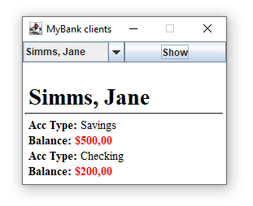
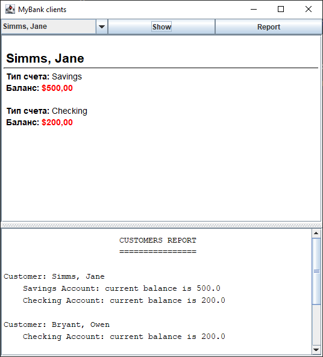

# Lab 3
# Створення GUI з допомогою Swing
Мета роботи - навчитись створювати прості графічні інтерфейси з допомогою Swing.

## На "трійку"

## Результат:

## На "чотири"

## Результат:

## На "п'ять"

## Результат:

